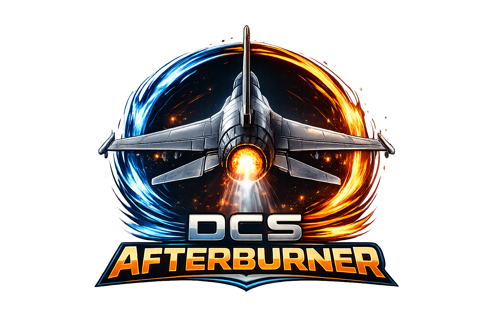

# DCS-Afterburner


A mission linting, diagnostics, and safe optimization toolkit for DCS World `.miz` files.

**[Browser-based mission analyzer →](https://tylerdoc1776.github.io/dcs-afterburner/)** — drop a `.miz` (and optional `dcs.log`) directly in your browser. No install required, nothing uploaded.

Analyze missions before deployment, catch common performance killers, compare versions over time, and optionally apply low-risk automatic optimizations. Optionally load a `dcs.log` file alongside any mission to correlate static findings with real runtime errors.

---

## What it does

DCS `.miz` files are ZIP archives containing Lua-based mission configuration. Afterburner unpacks them, inspects the contents, and runs heuristic checks against known performance and stability patterns.

```
$ afterburner analyze operation_iron_rain.miz

 Theatre            Caucasus
 Total units            2 104
   Active at start        648
   Late activation      1 456
 Player slots              32
 Groups (total)           312
   Active groups          174
 Static objects           823
 Triggers                 168
 Trigger zones            124

Risk score: 34/100 — CRITICAL

  CRITICAL  BLOT_001  Extreme active unit count
            648 units active at mission start (threshold: 600). Severe performance
            risk on multiplayer servers.
            Fix: Move non-essential groups to late activation.

  CRITICAL  BLOT_002  Extreme static object count
            823 static objects (threshold: 800). Static objects are rendered and
            simulated regardless of player proximity.
            Fix: Remove decorative statics far from the action area.

  WARNING   BLOT_003  High trigger count
            168 triggers (threshold: 150). Trigger evaluation runs every server frame.
            Fix: Consolidate redundant triggers or convert to script-driven logic.

  WARNING   BLOT_004  High trigger zone count
            124 trigger zones (threshold: 90). Active zones are evaluated every frame.
            Fix: Remove unused zones or merge overlapping zones with identical radii.

  WARNING   BLOT_008  Very high total unit count
            2104 total units (threshold: 1200). Late-activated units still consume
            server memory.
            Fix: Audit late-activation groups and remove units unused by the mission.

  WARNING   PERF_001  CTLD script detected
            CTLD detected in mission scripts. Polling loops run every 1–2s over all
            registered transport pilots regardless of player count.
            Fix: Reduce registered pilot names or use an event-driven CTLD build.

  INFO      MAINT_001  Missing mission description
            Sortie name is blank. Add a description in the mission editor for easier
            server-side identification.
```

---

## Use cases

- **Pre-release validation** — scan a mission before putting it on the server
- **Live issue diagnosis** — load a `dcs.log` to find what broke during the last session
- **Legacy cleanup** — find obvious performance problems in old missions
- **Before/after comparison** — check if a new version got heavier or cleaner
- **Safe optimization** — apply low-risk cleanup automatically with a backup
- **CI gate** — fail a build if a mission exceeds thresholds or contains banned patterns

---

## Installation

```bash
pip install dcs-afterburner
```

Or from source:

```bash
git clone https://github.com/your-org/dcs-afterburner
cd dcs-afterburner
pip install -e .
```

---

## Usage

```bash
# Analyze a mission and print a summary
afterburner analyze mission.miz

# Output machine-readable JSON (for CI/CD or dashboards)
afterburner analyze mission.miz --json

# Generate a markdown report
afterburner report mission.miz --format md

# Apply safe optimizations (always creates a backup first)
afterburner optimize mission.miz --safe

# Compare two versions of a mission
afterburner diff old.miz new.miz

# Analyze with a DCS log file for runtime correlation
afterburner analyze mission.miz --log dcs.log

# Inspect a log file on its own
afterburner logs dcs.log

# List all available rules
afterburner rules list

# Explain a specific rule
afterburner rules explain PERF_001
```

---

## What gets checked

**Mission size and bloat**
- Excessive unit, static object, trigger, and zone counts
- Oversized embedded script blocks
- Large archive payload and duplicate assets

**Trigger system**
- Excessive continuous / polling triggers (`TIME MORE` patterns)
- Duplicate trigger actions
- Missing or non-descriptive trigger names

**AI and unit performance**
- High density of active AI groups at mission start
- Large ground formations in small areas
- Route complexity above threshold
- Excessive late-activation groups

**Scripts and Lua**
- Oversized embedded scripts
- Duplicate script frameworks (MOOSE, MIST, CTLD bundled multiple times)
- Timer-heavy and loop-heavy code patterns
- Heavy event handlers without filtering

**DCS log analysis** *(optional — supply a `dcs.log`)*
- Lua errors and stack traces from the last session
- Scheduler spam and high-frequency timer abuse
- Repeated errors indicating runaway loops
- Framework load failures and nil dereferences
- Runtime confirmation of static findings

**Multiplayer and server health**
- Too many active slots relative to mission complexity
- Excessive radio menu items
- High object density near spawn areas

**Maintainability**
- Unnamed or badly named groups
- Duplicate group names
- Missing mission metadata

---

## Configuration

Create an `afterburner.yaml` in your project to tune thresholds:

```yaml
rules:
  max_active_ground_units: 250
  max_trigger_count: 150
  max_script_size_kb: 1024
  warn_on_unnamed_groups: true

optimize:
  safe_mode_only: true
  create_backup: true

output:
  format: markdown
```

---

## Risk scoring

Each mission receives a score based on weighted findings:

| Score | Band |
|-------|------|
| 92–100 | LOW |
| 75–91 | MODERATE |
| 50–74 | HIGH |
| < 50 | CRITICAL |

Scores are always accompanied by an explanation. A score without reasons is not output.

---

## Safe optimization

The `--safe` flag applies only low-risk, reversible transformations:

- Remove exact-duplicate embedded assets
- Strip orphaned or temporary files from the archive
- Optionally rename unnamed groups and triggers using a safe prefix scheme

The following are **never modified automatically**:
- AI routes
- Trigger logic
- Group or unit deletion
- Mission balance or tasking behavior

Every optimization run produces a change log listing each change as `applied`, `skipped`, or `unsafe`.

---

## GitHub Actions

```yaml
- name: Lint mission files
  run: |
    pip install dcs-afterburner
    afterburner analyze *.miz --json > report.json
    afterburner analyze *.miz --fail-on critical
```

---

## License

MIT
